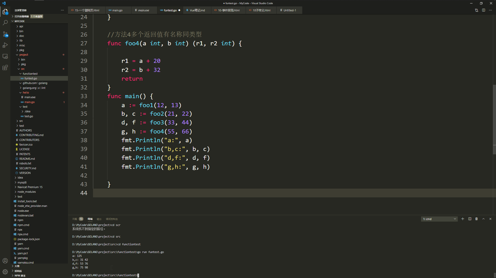
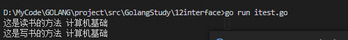
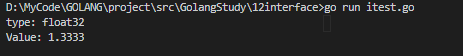
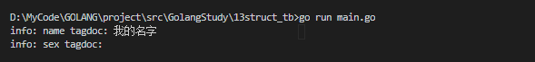
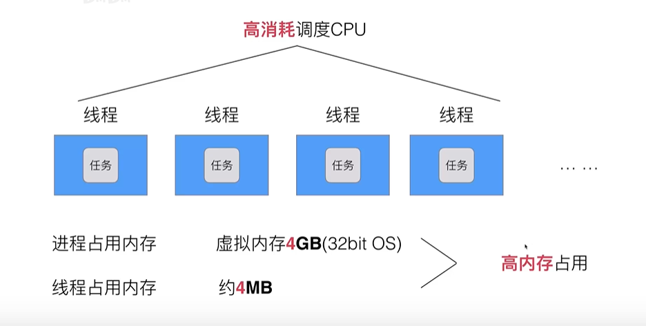
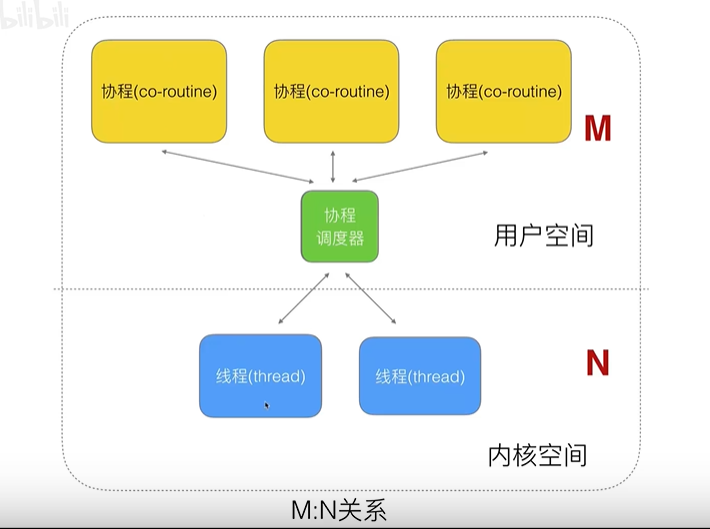
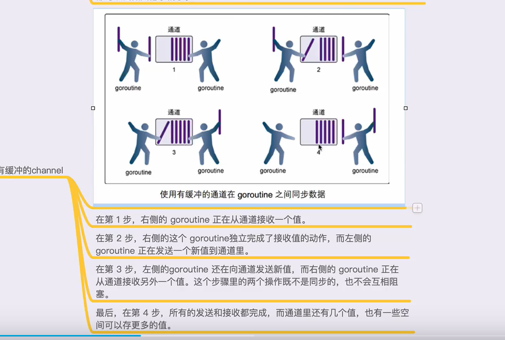

# GoLang基础编程

## 环境使用基本命令

### 编译运行go run 

使用方法：go run 程序名.go 


### 编译并生成执行文件go bulid

使用方法：go build 文件名.go

说明：将在同目录下生成exe可执行文件


## 变量声明的方法

### 四种基础方式

方法1~3可以用在全局声明

方法4只能用在函数内

```go
package main

import "fmt" // 导入内置 fmt

func main() { // main函数，是程序执行的入口

	//方法1默认值为0
	var a int
	//方法2设置默认值
	var b int = 10
	//方法3直接设置值自动匹配数据类型
	var c = 10
	//方法4省略var关键词,会自动匹配数据类型
	d := "test"
	fmt.Println("a:", a)
	fmt.Printf("b is type %T\n", b)
	fmt.Printf("c is type %T\n", c)
	fmt.Printf("d is type %T\n", d)

}

```


### 多个变量的两种方法

```go
var xx,yy,zz int=100,200,300
var(
xa int=100
xb string="teststring"
)
```

## 常量声明方法

```go
//单个声明方式是
const length int=100
//多个变量声明方式
const(
    beijing=1
    shanghai=2
    
)
//iota是自动+1
const(
    beijing=iota //beijing值=0
    shanghai     //shanghai值=1
)
//iota可以做运算
	const (
		ia, ib = iota + 1, iota + 2
		ic, id
	)
	fmt.Println("ia:", ia, "ib", ib, "ic", ic, "id", id)
```


## 函数声明和调用方法

```go
package main

import "fmt"

// 导入内置 fmt
//方法1一个返回值
func foo1(a int, b int) int {

	c := a + b + 100
	return c
}

//方法2多个返回值匿名
func foo2(a int, b int) (int, int) {
	return a + 10, b + 20
}

//方法3多个返回值有名称
func foo3(a int, b int) (r1 int, r2 int) {

	r1 = a + 20
	r2 = b + 32
	return
}

//方法4多个返回值有名称同类型
func foo4(a int, b int) (r1, r2 int) {

	r1 = a + 20
	r2 = b + 32
	return
}
func main() {
	a := foo1(12, 13)
	b, c := foo2(21, 22)
	d, f := foo3(33, 44)
	g, h := foo4(55, 66)
	fmt.Println("a:", a)
	fmt.Println("b,c:", b, c)
	fmt.Println("d,f:", d, f)
	fmt.Println("g,h:", g, h)

}
```




## import包路径和init方法流程


### 目录结构


### import引用路径

Import包的目录应该在GOPATH下的路径，注意并非是包含文件名，仅目录。

GOPATH路径

D:\MyCode\GOLANG\project\

绝对路径

D:\MyCode\GOLANG\project\src\GolangStudy\04init\lib1

引用路径

"GolangStudy/04init/lib1"

### import引用方式

1. 匿名引用使用加一个_符号，这种方法将运行包中的inin。 import (_"GolangStudy/04init/lib1"),

2. 正常引用 import ("GolangStudy/04init/lib1")

3. ## 别名引用,将Lib1的名字改为mylib1

     import (mylib1	"GolangStudy/04init/lib1")

4. 全部导入加一个.，这样将包内部方法导入当前文件，直接使用。 import (."GolangStudy/04init/lib1")


### 一个示例

#### main.go

```go
package main

import (
	"GolangStudy/04init/lib1"
	"GolangStudy/04init/lib2"
	"fmt"
)

func main() {
	fmt.Println("test")
	lib1.Lib1Test()
	lib2.Lib2Test()
}

```

#### lib1.go

```go
package lib1

import "fmt"

func Lib1Test() {
	fmt.Println("lib1.test()...")
}

func init() {
	fmt.Println("lib1.init()....")
}

```

#### lib2.go

```go
package lib2

import "fmt"

func Lib2Test() {
	fmt.Println("lib2.test()...")
}

func init() {
	fmt.Println("lib2.init()....")
}

```

#### 测试结果


## 指针讲解


#### 例子图示


#### 传指针的示例

```go
package main

import "fmt"

func changeValue(p *int) {
	*p = 10
}
func main() {
	var d int
	changeValue(&d)
	fmt.Println("d_valve", d)
}

```

#### 指针的相关符号

&变量，表示该变量的内存地址

*变量，指向变量内存地址

 var  a int=1

var p *int

p=&a

*p=100

结果会是100

#### 多级指针

```go
package main

import "fmt"
//二级指针用法
func main() {
	var a string = "hello"

	var p2 *string
	var p1 **string

	p2 = &a
	p1 = &p2

	//p1 = &a
	**p1 = "dong"

	fmt.Println("a is ", a)

}

```


## defer语句调用顺序


加入defer语句后，总是在return以后执行defer,如果有多个defer语句则，先入后出，最后一个先执行，第一个最后执行。

```go
package main

import "fmt"

func fun1() {
	fmt.Println("this is fun1")
}
func fun2() {
	fmt.Println("this is fun2")
}
func fun3() {
	fmt.Println("this is fun3")
}

func main() {
	defer fun1()
	defer fun2()
	defer fun3()
	fmt.Println("this is main..")
}

```


## 数组

数组的两种遍历方式，关键字 range ，需要注意动态数据和固定数组两种的传递形式不同，固定数组是传值，动态数组是传址（可以修改传过去的数组内容）

### 固定数组

```go
package main

import "fmt"

//基本数组定义和遍历,固定长度
func arrayTest() {
	var myarray1 [10]int
	for i := 0; i < len(myarray1); i++ {
		fmt.Println(myarray1[i])
	}
}

//预设值数组和另一种遍历
func array1Test() {
	myarray2 := [10]int{1, 2, 3, 4, 5, 6, 7, 8, 9, 10}
	for index, valve := range myarray2 {
		fmt.Println("index=", index, valve)
	}
}

func main() {

	arrayTest()
	array1Test()
}

```


### 动态数组slice切片

```go
package main

import "fmt"

//基本数组定义和遍历,固定长度
func arrayTest() {
	var myarray1 [10]int
	for i := 0; i < len(myarray1); i++ {
		fmt.Println(myarray1[i])
	}
}

//预设值数组和另一种遍历
func array1Test() {
	myarray2 := [10]int{1, 2, 3, 4, 5, 6, 7, 8, 9, 10}
	for index, valve := range myarray2 {
		fmt.Println("index=", index, valve)
	}
}

//动态数组定义和遍历
func array2Test(array1 []int) {
	for _, valve := range array1 {
		fmt.Println("valve is ", valve)
	}
	//测试对传过来的数组进行修改
	array1[1] = 999
}

func main() {
	var myarray1 = []int{1, 2, 3, 4, 5, 6, 7}

	arrayTest()
	array1Test()
	array2Test(myarray1)
	for _, valve := range myarray1 {
		fmt.Println("valve is ", valve)
	}

}
```


## slice切片

#### make使用

说明：make是分配切片空间，用法：make(类型,空间,容量)

示例：slice3 = make([]int, 3) 

```go
package main

import "fmt"

func main() {
	//声明slice1是一个切片，并且初始化，默认值1，2，3，长度Len是3
	slice1 := []int{1, 2, 3}
	fmt.Printf("len=%d,slice=%v\n", len(slice1), slice1)
	//声明slice2是一个切片，仅初始化但是不分配空间

	//var slice2 []int

	//slice2[0]=33  会报错，因为未分配空间
	//--------------------------------------------------------

	//声明slice3是一个切片，初始化并使用make开辟空间
	var slice3 []int
	slice3 = make([]int, 3)
	slice3[0] = 220
	fmt.Printf("len=%d,slice=%v\n", len(slice3), slice3)
	//另一种初始化方式
	slice4 := make([]int, 5)
	//slice4[1] = 999
	fmt.Printf("len=%d,slice=%v\n", len(slice4), slice4)
	//判断一个silce是否为0
	if slice4 == nil {
		fmt.Println("这是一个空的切片")
	} else {
		fmt.Println("这是一个有值的")
	}

}
```


make([int],3,5)


#### 切片相关函数

len 切片长度

cap 切片容量

append 切片追加元素

```go
package main

import "fmt"

func main() {
	var numbers = make([]int, 3, 5)

	fmt.Printf("len=%d,cap=%d,slice=%v\n", len(numbers), cap(numbers), numbers)
    //len=3,cap=5,slice=[0 0 0]
	//向numbers切片追加一个元素1，numbers len=4,cap=5
	numbers = append(numbers, 1)
	fmt.Printf("len=%d,cap=%d,slice=%v\n", len(numbers), cap(numbers), numbers)
	//len=4,cap=5,slice=[0 0 0 1]
	numbers = append(numbers, 2)
	fmt.Printf("len=%d,cap=%d,slice=%v\n", len(numbers), cap(numbers), numbers)
	//len=5,cap=5,slice=[0 0 0 1 2]
	numbers = append(numbers, 3)
	fmt.Printf("len=%d,cap=%d,slice=%v\n", len(numbers), cap(numbers), numbers)
    //len=6,cap=10,slice=[0 0 0 1 2 3],追加元素空间不够直接又增加了一倍的容量
}

```


#### 切片取元素

截取切片的一部分元素,使用:进行范围设定，可以是x:y,或者是:y(从0到y个)，也可以x:(从x到结尾)

```
s:=[]int{1,2,3}//len=3,cap=3
s1:=s[0:2]//[1,]
```

[^注意]: 两个都是指针，指向同一区域，如果想要复制值的话使用以下方法

```go
s2:=make([]int,3)
copy(s2,s)//将s中的值拷贝到s2中去
```

## map使用

#### 基本使用

```go
package main

import "fmt"

func main() {
	//第一种方式
	//声明myMap是一种map类型，key是string,value是string
	var myMap1 map[string]string
	if myMap1 == nil {
		fmt.Println("这是一个空的map")
	}
	//使用map前需要给map分配数据空间
	myMap1 = make(map[string]string, 10)

	myMap1["one"] = "java"
	myMap1["two"] = "c++"
	myMap1["three"] = "python"
	fmt.Println(myMap1)

	//第二种方式，不设定初始空间
	myMap2 := make(map[int]string)
	myMap2[1] = "java"
	myMap2[2] = "php"
	fmt.Println(myMap2)

	//第三种方式
	myMap3 := map[string]string{
		"one":   "php",
		"two":   "c++",
		"three": "python",
	}
	fmt.Println(myMap3)

}

```


#### 遍历使用增删改查

```go
package main

import "fmt"

func main() {

	citymap := make(map[string]string)

	citymap["china"] = "beijing"
	citymap["japan"] = "tokyo"
	citymap["USA"] = "NewYork"

	//遍历
	for key, value := range citymap {
		fmt.Println("key=", key, "value=", value)

	}

	//删除
	delete(citymap, "china")
	//修改
	citymap["USA"] = "DC"
	//遍历
	for key, value := range citymap {
		fmt.Println("key=", key, "value=", value)

	}
}

```


## struct结构体

```go
package main

import "fmt"

type book struct {
	title string
	auth  string
}

func changebook(book1 *book) {
	book1.title = "你的故事"
}

func main() {
	var book1 book
	book1.auth = "青岛输电"
	book1.title = "我的故事"
	fmt.Println("this book title is", book1)
	//传址方式调用自定义类型函数
	changebook(&book1)
	fmt.Println("this book title is", book1)
}

```


## 类的声明使用

### 基本用法

### 注意大小写代表作用域

注意首字母是大写的其他包能够使用，首字母是小写的只有本包可以使用，注意方法应该加*使用传址方式而不是传值方式

```go
package main

import "fmt"

//相当于声明类内属性
type person struct {
	name string
	addr string
}

//声明一个方法,获取属性
func (this *person) GetName() string {
	return this.name
}

//声明一个方法,设置属性
func (this *person) SetName(name1 string) {
	this.name = name1
}

func main() {
	dong := person{name: "zhangsan", addr: "qingdao"}
	fmt.Println(dong.name, dong.addr)
	dong.SetName("wangketing")
	fmt.Println("this class name is", dong.name, dong.addr, "--get:", dong.GetName())

}

```


### 类的继承


```go
package main

import "fmt"

//父类
//类的类型
type Desk struct {
	name  string
	hight float32
}

//父类的方法
func (this *Desk) SetName(sname string) {
	this.name = "这是父类的方法"
}

//----------------------------
//子类
type BookDesk struct {
	Desk
	bookname string //新增属性
}

//新增方法
func (this *BookDesk) SetBookName(sname string) {
	this.bookname = "这只子类的新方法" + sname

}

//重定义父类方法
func (this *BookDesk) SetName(dname string) {
	this.name = "这是子类的方法" + dname

}

func main() {
	//第一种初始化方式

	bookdesk1 := BookDesk{Desk{"松木卓", 1.43}, "诗经"}

	fmt.Println("子类属性", bookdesk1.name, bookdesk1.bookname, bookdesk1.hight)
	bookdesk1.SetName("子类的设置")
	fmt.Println("子类属性", bookdesk1.name, bookdesk1.bookname, bookdesk1.hight)
	//另一种初始化方式
	var bookdesk2 BookDesk
	bookdesk2.name = "桃木桌"
	bookdesk2.hight = 1.55
	bookdesk2.bookname = "这是另一种初始化方式"
	fmt.Println("子类属性", bookdesk2)

}

```


## 接口interface

接口多态的实现

### 多态的基本要素

有一个父类（有接口）

又子类（实现了父类的全部接口方法）

父类类型的变量（指针）指向（引用）子类具体数据变量

```go
package main

import "fmt"

//本质是指针
type AnimalIF interface {
	Sleep()           //动物睡觉
	GetColor() string //获取动物的颜色
	GetType() string  //获取动物的种类
}

//具体的类猫
type Cat struct {
	color string //猫的颜色
}

func (this *Cat) Sleep() {
	fmt.Println("cat is sleep")
}

func (this *Cat) GetColor() string {
	return this.color
}
func (this *Cat) GetType() string {
	return "Cat"
}

//具体的类狗
type Dog struct {
	color string //猫的颜色
}

func (this *Dog) Sleep() {
	fmt.Println("Dog is sleep")
}

func (this *Dog) GetColor() string {
	return this.color
}
func (this *Dog) GetType() string {
	return "Dog"
}

//使用了多态的示例
func ShowAnimal(animal AnimalIF) {
	animal.Sleep() //多态
	fmt.Println("color is：", animal.GetColor())
	fmt.Println("Kind is :", animal.GetType())

}

func main() {
	/*
		var animal AnimalIF    //接口的数据类型，父类指针
		animal = &Cat{"Green"} //接口猫态
		animal.Sleep()
		animal = &Dog{"yellow"} //接口狗态
		animal.Sleep()
	*/
	cat := Cat{"Green"}
	dog := Dog{"Yello"}

	ShowAnimal(&cat)
	ShowAnimal(&dog)
}

```


### interface空接口，断言，万能类型接口

```go
package main

import "fmt"

func myFunc(arg interface{}) {
	fmt.Println("myFunc is called..")
	fmt.Println(arg)
	//golang为interface{}提供了类型断言，可以判断数据类型,可以根据数据类型做响应操作
	value, ok := arg.(string)
	if !ok {
		fmt.Println("arg is not string type")
	} else {
		fmt.Println("arg is string type,value=", value)
		fmt.Printf("value type is %T\n", value)
	}

}

type Book struct {
	name string
}

func main() {
	book1 := Book{"Golang"}

	myFunc(book1)
	myFunc(100)
	myFunc("dong")
	myFunc(3.14)

}

```


## 变量pair

在golang中每一个变量包含type和value，


```go
package main

import "fmt"

func main() {
	//无论一个变量在哪里都会携带type和value的成对（pair）信息
	var ift interface{}
	var s1 string
	s1 = "dong"
	ift = s1
	str, strvalue := ift.(string)
	fmt.Println(str, strvalue, ift)
}

```


```go
package main

import "fmt"

type Reader interface {
	ReadBook()
}
type Writer interface {
	WriterBook()
}

//具体的类型
type Book struct {
	Name string
}

func (this *Book) ReadBook() {
	fmt.Println("这是读书的方法", this.Name)
}
func (this *Book) WriterBook() {
	fmt.Println("这是写书的方法", this.Name)
}

func main() {

	//b:pair<type>Book,Value:Book()地址>
	b := &Book{"计算机基础"}

	var r Reader
	r = b
	//r:pair<type>Book,Value:Book()地址>
	r.ReadBook()
	var w Writer
	w = r.(Writer) //此处为什么能断言成功？因为w r的type是相同的
	//w:pair<type>Book,Value:Book()地址>

	w.WriterBook()
}

```



## 反射reflect包

### 反射基础

TypeOf()反射出类型

ValueOf()反射出值

```go
package main

import (
	"fmt"
	"reflect"
)

//reflect 是反射，Typeof 反射出类型，Valueof反射出值
func reflectNum(arg interface{}) {
	fmt.Println("type:", reflect.TypeOf(arg))
	fmt.Println("Value:", reflect.ValueOf(arg))

}

func main() {
	var num float32 = 1.3333
	reflectNum(num)
}

```




### 反射中使用field

Field(i)获取第i个元素，inputType.Field(i);   

inputType.NumField()总共有多少个Field  字段

```go
package main

import (
	"fmt"
	"reflect"
)

type User struct {
	Id   int
	Name string
	Age  int
}

func (this *User) getid() string {
	return this.Name

}

func DoFiledAndMethod(input interface{}) {
	inputType := reflect.TypeOf(input)
	//获取输入值类型
	fmt.Println("inputTypeis:", inputType)

	inputValue := reflect.ValueOf(input)
	//获取输入值
	fmt.Println("inputValueis:", inputValue)

	//通过Type,获得类型里面的字段
	//1、获取interface的reflect.Type,通过Type得到NumFleld,进行遍历
	//2、得到每个field,数据类型
	//3、通过field有一个Interface()方法得到对应的value
	for i := 0; i < inputType.NumField(); i++ {
		field := inputType.Field(i)
		value := inputValue.Field(i).Interface()
		fmt.Println(field.Name, field.Type, value)

	}
	//通过Type，获得里面的方法
	for i := 0; i < inputType.NumMethod(); i++ {
		m := inputType.Method(i)
		fmt.Println(m.Name, m.Type)

	}

}
func main() {
	var xuser User
	xuser.Age = 15
	xuser.Id = 1
	xuser.Name = "dong"
	DoFiledAndMethod(xuser)
}

```


### 结构体标签


```go
package main

import (
	"fmt"
	"reflect"
)

type resume struct {
	Name string `info:"name"doc:"我的名字"`
	sex  string `info:"sex"`
}

func findTag(str interface{}) {
	t := reflect.TypeOf(str).Elem()
	for i := 0; i < t.NumField(); i++ {
		taginfo := t.Field(i).Tag.Get("info")
		tagdoc := t.Field(i).Tag.Get("doc")
		fmt.Println("info:", taginfo, "tagdoc:", tagdoc)

	}
}
func main() {
	var re resume
	findTag(&re)

}

```




## JSON的使用-结构体标签

使用包encoding/json

编码使用Json.Marshal() 类型转换成json

解码使用Json.Unmarshal() json转换成类型

```go
package main

import (
	"encoding/json"
	"fmt"
)

type Movie struct {
	Title  string   `json:"title"`
	Year   int      `json:"year"`
	Price  int      `json:"price"`
	Actors []string `json:"actors"`
}

func main() {
	movie := Movie{"戏剧之王", 2001, 23, []string{"周星驰", "董跃鹏"}}
	//编码，将结构体转换成json
	jsonstr, err := json.Marshal(movie)
	if err != nil {
		fmt.Println("josn转换错误")
		return
	}

	fmt.Println(jsonstr)
	fmt.Printf("jsonStr=%s\n", jsonstr)

	//解码，将json转换成结构体

	mymovie := movie
	err = json.Unmarshal(jsonstr, &mymovie)
	if err != nil {
		fmt.Println("josn转解码换错误", err)
		return
	}

	fmt.Printf("jsonStr=%v\n", mymovie)

}

```


## Golang的协程

### 系统知识

#### 传统单线程


单线程的问题是，单个处理，会阻塞

#### 时间切片多线程/进程


问题


#### 传统进程/线程  需要解决的问题




线程的结构


N/1的用户空间和内核空间，线程对应关系


目前常规的协程处理



#### Golang对协程的处理


#### Golang调度器的设计策略

##### 复用线程

work stealing机制（偷取机制）

1、当前状况


2、M2没有协程的时候偷取一个


hand off 机制

1、当线程阻塞时


2、将G1和M1绑定，并创建/唤醒一个thread


##### 利用并行   

GOMAXPROCS限定P的个数

常规情况下利用CPU核心数的一半，这样可以空出CPU给其他资源使用。


##### 抢占策略


每一个goroutine最多抢占cpu10ms


##### 全局G队列


G2先从P的本地队列偷取，偷不到没有的情况下从全局偷取


### Golang协程的实际使用相关知识

#### 1、创建一个协程并使用它

方法：使用go关键字加在方法前

```go
package main

import (
	"fmt"
	"time"
)

func newTask() {
	i := 0
	for {
		i++
		fmt.Println("newGoroutine:i=", i)
		time.Sleep(1 * time.Second)
	}
}

func main() {
	//创建一个GO程，去执行newTask()流程
	//使用go关键字创建一个goroutine
	go newTask()
	i := 0
	for {
		i++
		fmt.Println("main goroutinei=", i)
		time.Sleep(1 * time.Second)
	}
}

```


#### 2、使用匿名协程,退出协程指令runtime.Goexit()


```go
package main

import (
	"fmt"
	"runtime"
	"time"
)

func newTask() {
	func() {
		fmt.Println("这是GO程1_1未退出前")
		runtime.Goexit()
		fmt.Println("这是GO程1_1退出后")
	}()

	fmt.Println("这是GO程1")
}

func main() {
	go func() {
		i := 0
		for {
			i++
			fmt.Println("这是一个匿名协程,第", i, "次执行")
			time.Sleep(10 * time.Second)
		}
	}()

	go newTask()
	//不断循环

	i := 0
	for {
		i++
		fmt.Println("这是主线程,第", i, "次执行")
		time.Sleep(1 * time.Second)

	}
}

```


### Golang协程管道channel


#### 无缓存的channel

关键字chan 示例 C:=make(chan int) 定义一个无缓存的管道


```go
package main

import (
	"fmt"
)

func main() {
	//定义一个channel
	c := make(chan int)

	go func() {
		defer fmt.Println("goroutine 结束")
		fmt.Println("goroutine 正在运行中")
		c <- 666 //将666发送到c管道中channel

	}()

	num := <-c
	fmt.Println("主线程接受到的值", num)
	fmt.Println("主线程结束")

}
```


#### 有缓存的channel

定义方法 c:=make(chan int,3) 含义时定义了一个3个缓存的管道



```go
package main

import (
	"fmt"
	"time"
)

func main() {
	c := make(chan int, 3) //定义一个3次的缓存
	go func() {

		for i := 0; i < 10; i++ {
			c <- i
			fmt.Println("这是子GO程第", i, "次执行", "len=", len(c), "cap=", cap(c))
		}

	}()
	time.Sleep(3 * time.Second)
	i := 0
	for {
		i++
		nmu := <-c
		fmt.Println("这是主线程第", i, "次执行得到的协程值是：", nmu)
	}

}

```


#### 循环通过channel带缓存的传值

```go
package main

import (
	"fmt"
	"time"
)

func main() {
	c := make(chan int, 5) //定义一个3次的缓存
	s1 := make(chan string, 5)
	go func() {
		i := 0

		for {
			i++
			fmt.Println("这是子GO程第", i, "次执行", "len=", len(c), "cap=", cap(c))
			c <- i
			s1 <- "这是子GO程1"
			time.Sleep(1 * time.Second)

		}
	}()

	go func() {
		i := 0

		for {
			i++
			fmt.Println("第二个GO程第", i, "次执行", "len=", len(c), "cap=", cap(c))
			c <- i
			s1 <- "这是子GO程2"
			time.Sleep(1 * time.Second)

		}
	}()

	time.Sleep(3 * time.Second)
	i := 0
	for {
		i++
		nmu := <-c
		gstr := <-s1
		fmt.Println("这是主线程第", i, "次执行得到的协程值是：", nmu)
		fmt.Println("这是主线程获取的", gstr)
	}

}

```


带错误处理的循环管道传递

可以使用range来迭代，range可以却循环范围

```go
package main

import "fmt"

func main() {
	c := make(chan int, 3)

	go func() {
		for i := 0; i < 10; i++ {
			c <- i
		}
		//关闭thannel
		close(c)
	}()
	/*
		for {
			if data, ok := <-c; ok {
				fmt.Println("这是第", data, "次取到值")
			} else {
				fmt.Println("管道thannel已经关闭")
				break
			}
		}
	*/
	for data := range c {
		fmt.Println("这是第", data, "次取到值")
	}
	fmt.Println("主进程正常结束执行")
}

```

被注释掉的代码执行结果


当前代码执行结果


#### select和channel协同用法


```go
package main

import "fmt"

//当有多个通道用同一个模块处理时可以使用select
func numadd(c, quit chan int) {
	x, y := 1, 1
	for {
		select {
		case c <- x:
            //如果c可写，case就会进来
			x = y
			y = x + y
		case <-quit:
            //如果quit可读，case就会进来
			fmt.Println("quit")
			return
		}
	}
}
func main() {
	c := make(chan int)
	quit := make(chan int)

	go func() {
		for i := 0; i < 10; i++ {
			fmt.Println(<-c)
		}
		quit <- 0
	}()

	numadd(c, quit)

}

```


## GoModules使用


淘汰GOPATH的管理方式

